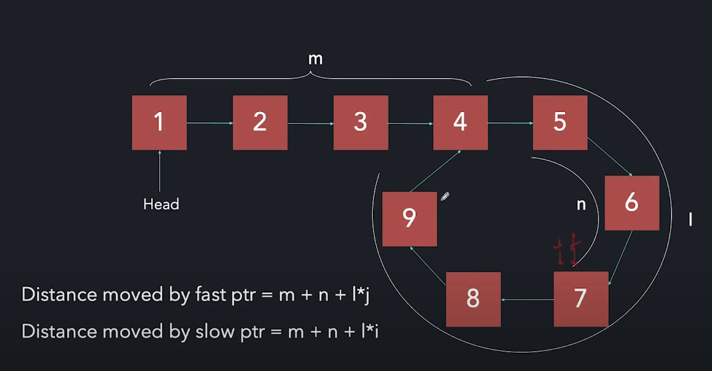
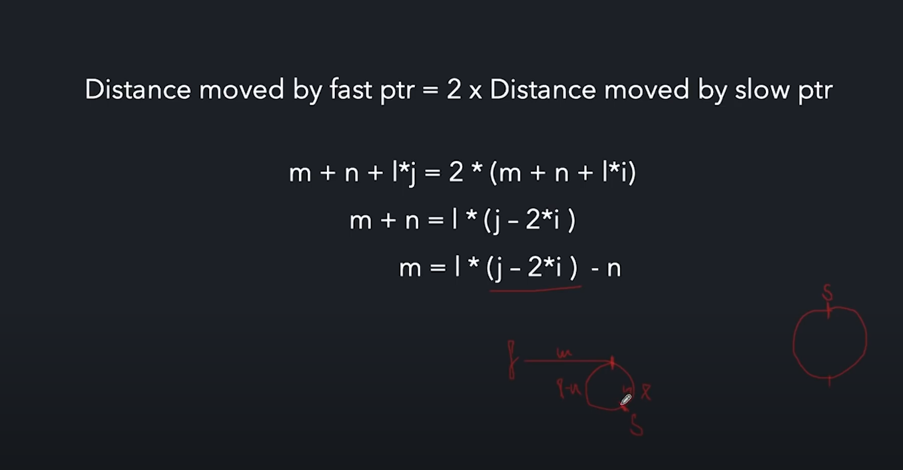

## Floyd's Tortoise and Hare Algorithm(Fast&Slow Pointer)

This approach is used to find the cycle in Linked List. We start from the head of LL with slow and fast pointer, slow travel by 1 distance at a time, and fast travel by 2 distance at time, if they meet it means there is cycle, if not(fast become null) then cycle is not present. 

How to find starting point of cycle ? 

For that, once they meet you can point one of the pointer again at head of LL and start traveling but this time both pointers move by 1 distance this time, when they meet it will be start point. 

Here is the proof, 



In this picture, L indicate the cyclic distance, and it is not fixed how many times both pointer travel that cyclic distance before they meet so we assume it is j and i respectively. m is starting distance and n is where they meet after. 



We know fast pointer travel 2 times distance then slow pointer. So we used that approach. As you can see at the end, 

$$
m = l * (k) - n
$$

where k is some integer value, indicate how many time cyclic distance traveled and again they reach at starting point. L is total distance. 

It means that, when we try to find starting points that time we move one of the pointer at the head of list. And start making traversal so second pointer covered l2 distance which is same as m. That's why we reached at starting of loop. 

                                

```cpp
    bool hasCycle(ListNode *head) {

        // Base case
        if (head == nullptr || head->next == nullptr)
            return false;

        ListNode* fast = head;
        ListNode* slow = head;

        do {
            slow = slow->next;
            fast = fast->next->next;
        } while (fast != nullptr && fast -> next != nullptr && slow != fast);   // odd length list, fast->next == NULL, even length = fast == nullptr

        return  slow == fast;
    }
```
